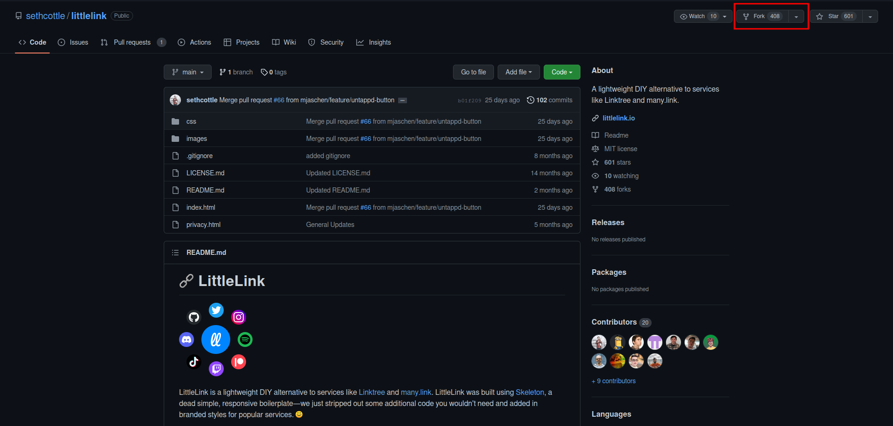
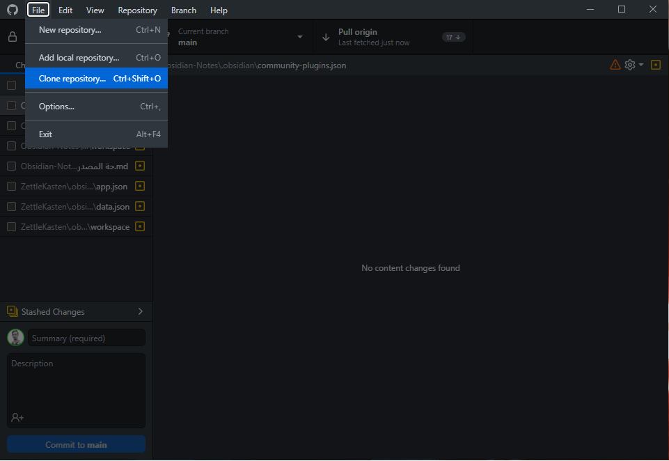
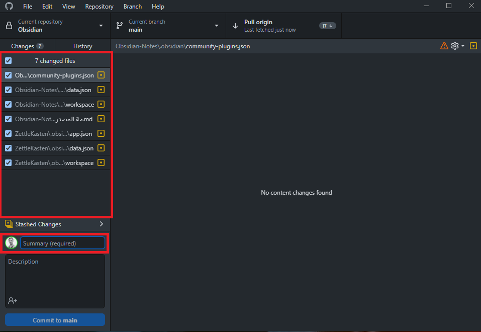
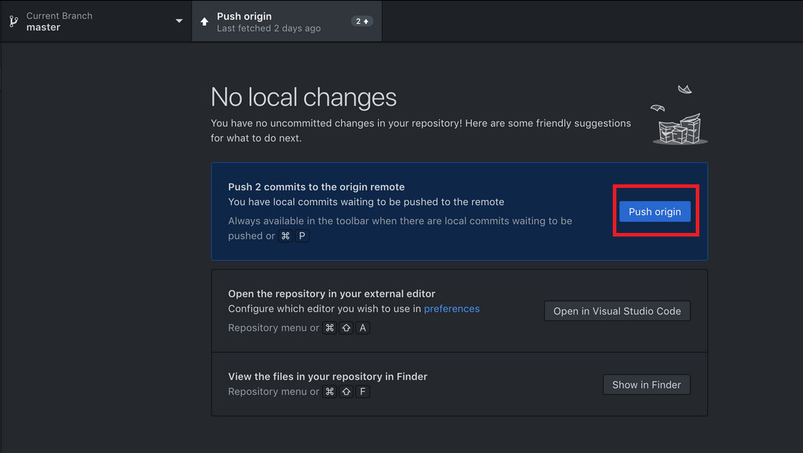
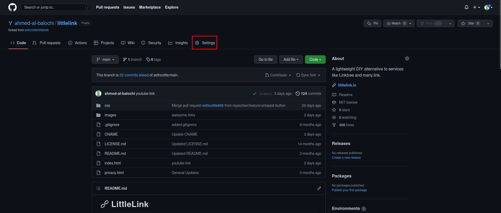
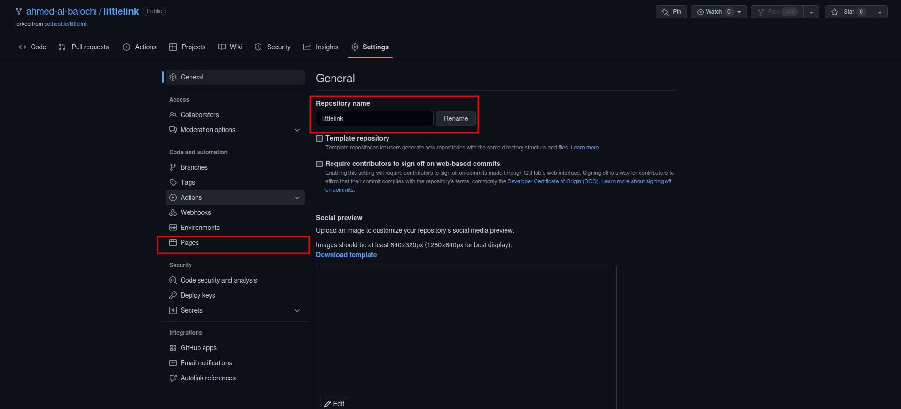
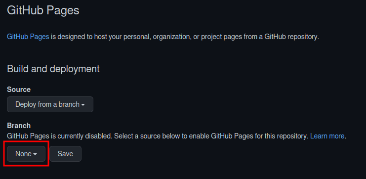
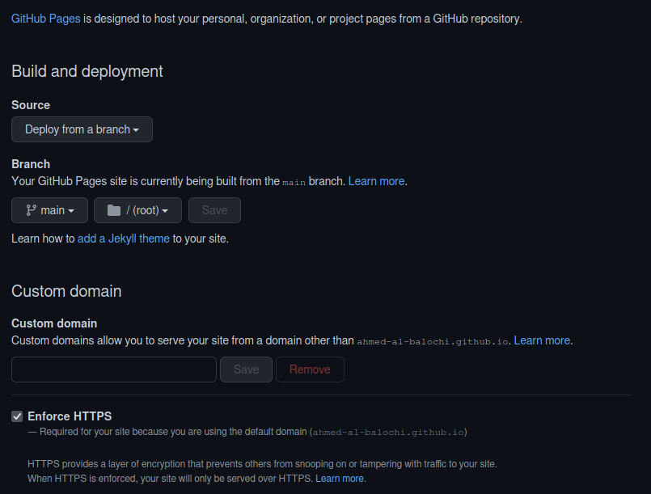

## متطلبات مسبقة
1. حساب [GitHub](https://github.com/).
2. برنامج [GitHub Desktop](https://desktop.github.com/) إذا كنت لا تعرف أوامر Git.
3. برنامج قارئ للنصوص مثل [VSCodium](https://vscodium.com/).

## مقدمة
هل تريد إنشاء روابطك الشخصية ولكن تحدك الخيارات في موقع/برنامج [LinkTree](https://linktr.ee/). هل تريد إضافة حسابك في Mastadon أو Matrix ولكن لا يوجد خيار للإضافة. أم انت من الذين يحبون الحرية التي توفرها البرامج المفتوحة المصدر؟ إن كان جوابك نعم فإبقى معي لتتعرف على برنامج [LittleLink](https://littlelink.io/).

## برنامج LittleLink
البرنامج بسيط جداً وهو مبني باستخدام أسهل لغات البرمجة وهي HTML و CSS. يقوم البرنامج بإعطائك قالب جاهز بروابط لأغلب المواقع والبرامج. مهمة البرنامج حسب المطورين هي:
1. سهولة الاستخدام.
2. سرعة الاستجابة والتحميل للصفحة.
3. تصميم جميل.
4. الحرية في التعديل ففي النهاية هو برنامج مفتوح المصدر.

## طريقة التحميل
1. عليك بالذهاب إلى صفحة [LittleLink على موقع GitHub]، ومن القيام بعمل Fork للصفحة.



2. عليك بتنزيل محتويات الصفحة عن طريق برنامج GitHub Desktop والقيام بحفظها في مجلد جديد.




## طريقة التعديل على القالب
1. قم بفتح المجلد في برنامج قارئ النصوص.
2. قم بفتح ملف ``` index.html ```.
3. الان يمكنك رؤية محتويات الملف ويمكننا الان التعديل عليه.

### لجعل صفحتك مميزة قم بالتالي
1. قم بتغيير ``` <title>LittleLink</title> ``` إلى ``` <title>أسمك أو العنوان الذي تريده</title> ```.
2. قم بتحريك الفأرة للأسفل وبتغيير الصورة الرمزية بحفظ الصورة التي تريدها(يجب ان تكون بصيغة png) في مجلد images بأسم avatar وقم بحذف المحتويات الاخرى. ولكي نجعل البرنامج باستخدام الصورة التي تم حفظها يجب تغيير:

```
 
```
إلى:

```

```
3. قم بتغيير ``` <h1>LittleLink</h1> ``` إلى ```<h1>أسمك أو العنوان الذي تريده</h1>```.
4. قم بتغيير السطر أسفل ```<!-- Short Bio -->``` الذي هو عبارة عن نبذة عنك بتغيير ماهو داخل  ```<p>...</p>```.
5.  قم بتحريك الفأرة للأسفل وسترى أسطر مرتبة فوقها أسماء المواقع، كل موقع لديه ثلاثة أسطر تحته. قم بحذف المواقع وأسطرها التي لا تريدها.
6. الان كل ما عليك فعله هو إستبدال علامة #  ووضع رابطك. فمثلاً عند وضع رابطك تكون النتيجة هكذا ```href="tech-ahmed.com"```.
7. قم بتكرار العملية للمواقع الأخرى.

### إنشاء رابط لموقع غير موجود في القالب
لأنشاء رابط لموقع غير موجود في القالب كل ماعليك فعله هو:
1. تنزيل ايقونة الموقع بصيغة svg وحفظها في مجلد images/icons.
2. تغيير التالي في الاسطر التالي:
```
<!-- اسم الموقع -->

<a class="button button-web" href="رابط الموقع" target="_blank" rel="noopener">

اسم الموقع</a>

<br>
```
فمثلا أنا قمت بإضافة رابط مجتمع Matrix الخاص بقناتي بعمل التالي:
```
<!-- Matrix -->

<a class="button button-web" href="https://matrix.to/#/%23Ahmed-Al-Balochi%3Amatrix.org" target="_blank" rel="noopener">

Matrix group</a>

<br>
```

## رفع التغييرات الى GitHub
قم برفع التعديلات كتالي:
1. قم بتشغيل برنامج GitHub Desktop.
2. من المفترض ان تظهر لك على بسار التطبيق الملفات التي قمت بالتعديل عليها.
3. قم بالتأكد من أن كل الملفات المعدلة قد تم تحديدها.
4. انقر على فراغ summary وقم بكتابة نبذة عن التغييرات.
5. قم بالنقر على زر commit to main.



6. قم بالنقر على زر push origin.



7. سترى ان التعديلات الان يتم رفعها الى GitHub.

## تفعيل البرنامج باستخدام GitHub Pages
بعد رفع التعديلات، حان وقت استخدامها. لا يوجد لديك موقع او عنوان؟ الحل هو GitHub Pages التي باستخدامها سيتوفر لنا موقع وعنوان لكي نشارك روابطنا مع العالم. طريقة التفعيل والاستخدام جداً سهلة لبدأ بشرح الخطوات.
1. قم بالذهاب الى صفحة البرنامج التي هي في حسابك.
2. بعدها انقر على الاعدادات.



3. قم بتغيير اسم المستودع او الصفحة الى name.github.io. قم بتغيير كلمة name الى اسمك الذي انت تستخدمه على GitHub.



4. بعد تغيير الاسم قم بالنقر على pages في يسار الصفحة.
5. قم بالنقر على none لاختيار main وقم بالنقر على save.



6. الان من المفترض تاخذ العملية عدة دقائق ويكون موقعك جاهز.




## الخاتمة
تعرفت على برنامج LittleLink من خلال تصفحي للأنترنت، وكنت أبحث عن برنامج بديل LinkTree بشرط ان يكون مفتوح المصدر. لذا قمت بتجربته وبعمل صفحة تضم [روابطي الشخصية](https://links.tech-ahmed.com)، أنصح بتجربة البرنامج اذا كنت تحب دعم البرمجيات المفتوحة المصدر أو تريد إنشاء شيء مميز خاص بك لسهولة التغيير في القالب اذا كنت مطور للويب.
أتمنى أن المقال وشرحي للبرنامج كان مفيداً لكم، أتطلع لمعرفة تجربتكم ورأيكم للبرنامج.


- أتشرف بمتابعتكم لي عبر المنصات التالية.

## روابط


- 📽 [My YouTube Channel](https://t.co/qNbPadCaHI?amp=1)

- 📽 [My Odysee Channel](https://odysee.com/$/invite/@CTRLplusA:7)

- 🐦 [My Twitter Profile](https://twitter.com/ahmedal_balochi)

- 💻 [My GitHub Profile](https://github.com/ahmed-al-balochi)

- 💼 [My LinkedIn Profile](https://www.linkedin.com/in/ahmed-al-balochi-b97b9b150/)

- 💰 [My Patreon Page](https://patreon.com/user?u=42792180)
